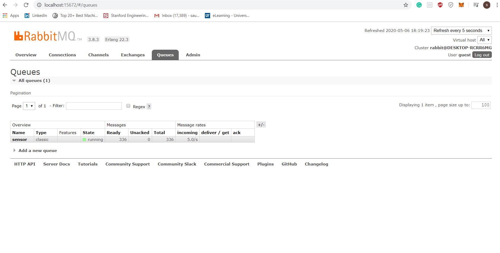
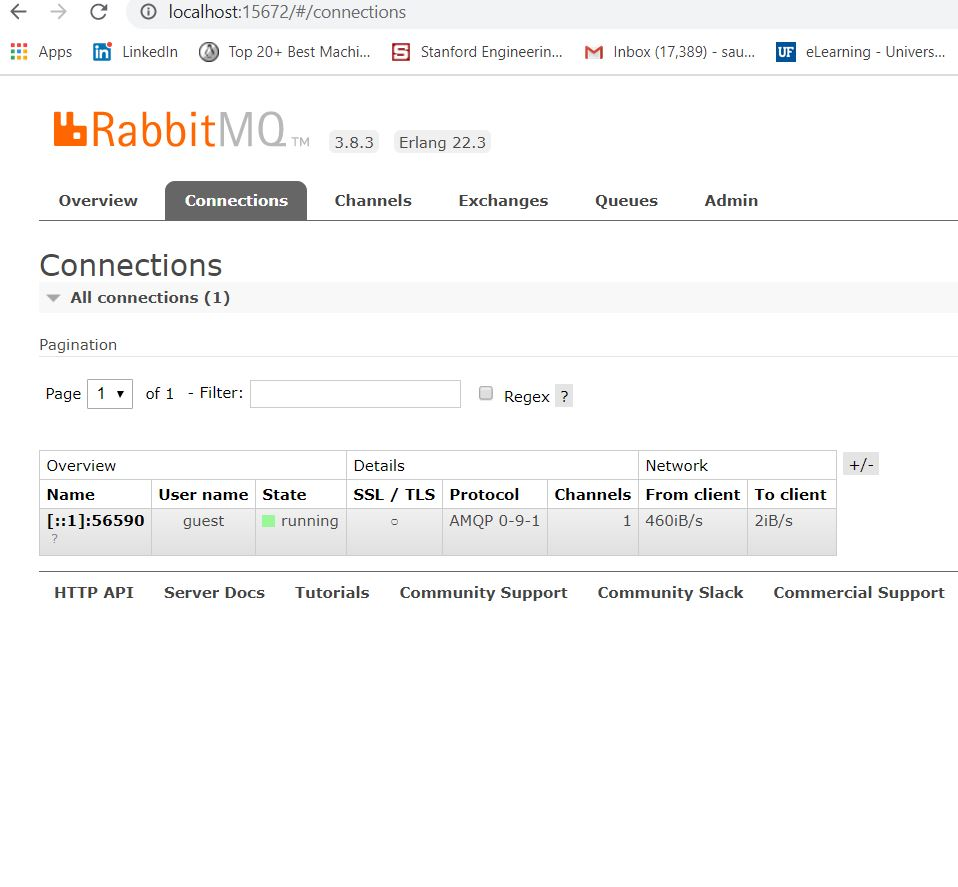
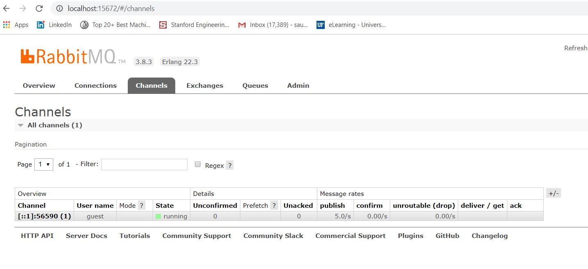

# Distributed-Messaging-Application-using-RabbitMQ-and-Golang

This is messaging application build using RabbitMQ as the message-broker. I implented this using Golang language as I wanted to learn Golang.

These screesnhots are the screesnhots of runnign the RabbitMQ server in local.
Before start of pushing the messages:

When message is being pushed:

once publishing message is stopped:

To run this appplication:
install RabbitMQ and Golang in your local.

Start the RabbitMQ server using the command:
rabbitmq-server start

Once the server starts run the code to publish the messages to the RabbitMQ using the following command:
go run sensor.go (after going into distributed/sensors directory).

This will start pushing the message to the message RabbitMQ.

